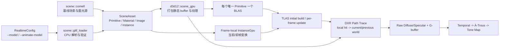

# 阶段 7：动态场景与 glTF 执行计划

## 1. 目标和执行策略

本阶段要把当前“代码生成的单一 Cornell Box 网格 + 单 BLAS + 单 TLAS 实例”升级为可加载 glTF 2.0 静态网格、节点层级和 PBR 纹理，并能更新刚体实例变换的 DXR 场景。动态物体必须生成包含实例运动的正确运动矢量，且不能每帧粗暴清空所有时域历史。

这不是一个单 commit 任务。推荐按本文的 7 个工作包逐步实现和提交；某个工作包如果仍过大，可以继续拆分，但每个 commit 都必须可编译、可测试，不能以“后续 commit 会修复”为由提交已知的破损状态。

### 1.1 完成定义

阶段 7 只有同时满足以下条件才能标记为完成：

- 不传模型参数时，默认 Cornell Box 的渲染、降噪、调试视图和 Shader 热更新不回归。
- `--model <path>` 可加载 `.gltf` 和 `.glb`，至少正确显示节点层级、网格实例、基础颜色、金属度/粗糙度、法线和自发光纹理。
- 同一 mesh 被多个 node 引用时共享 BLAS，不为每个实例重复上传顶点和构建 BLAS。
- `--animate-model` 使导入模型根实例连续旋转，TLAS 使用 update 路径，不重建静态 BLAS。
- 动态实例的 G-buffer 世界位置和运动矢量同时使用当前/上一帧物体变换；实例 ID 跨帧稳定。
- F1 的运动矢量、拒绝掩码、历史长度和 ID 视图能证明动态物体历史只在遮挡变化处被拒绝，而不是整屏每帧重置。
- RTX 4060 Laptop GPU 上的 Debug GPU-Based Validation 连续运行不出现 descriptor、resource state、TLAS update 或 device removed 错误。
- 1280×720 动态场景的基础帧率仍达到 60 FPS，TLAS update 目标不高于 1.5 ms。1920×1080 仅记录数据，不作为本阶段的 60 FPS 硬门槛。

## 2. 当前基线和必须保护的契约

当前代码的主要限制是：

- `src/renderer/d3d12/raytracing.rs` 同时包含 Cornell Box CPU 几何生成、GPU buffer 上传、BLAS/TLAS 构建和 DXR State Object，职责过度集中。
- `Vertex` 只有 position/normal，没有 UV 和 tangent。
- `Material` 是项目自定义的 diffuse/metal/glass/emissive 类别，不是 glTF metallic-roughness 数据。
- 所有三角形被打包到一组 buffer，只构建一个 BLAS 和一个 identity TLAS instance。
- DXR descriptor table 只有 6 个 SRV，没有材质纹理数组和每帧实例元数据。
- HLSL 把顶点坐标当成世界坐标，运动矢量只处理相机变化。

阶段 7 必须保护以下阶段 6 契约：

- DXR 只写原始独立信号和 G-buffer，时域、À-Trous 和 Tone Map 仍是独立 Compute Pass。
- `RawDiffuse` 与 `RawSpecular` 仍保持不同的降噪语义。
- `GBufferId == 0xFFFFFFFF` 仍表示 miss，其他 ID 必须跨帧稳定。
- resize、场景重载和突然切换模型必须设置 `reset_history`；普通刚体运动不得全屏重置。
- 不得引入每帧 `wait_for_gpu`。只能等待要复用的 Frame Context fence，以及 resize/退出/资源重建的明确安全点。
- HLSL/Rust 结构布局、root constants 大小和 descriptor 区间必须有自动化测试。

## 3. 本阶段范围

### 3.1 必须实现

- glTF 2.0 `.gltf` 和 `.glb`。
- 默认 scene；文件未指定 default scene 时使用第一个 scene。
- node 层级、TRS/matrix 累积、同 mesh 多实例。
- indexed/non-indexed triangle primitive。
- POSITION，可选 NORMAL、TEXCOORD_0 和 TANGENT。没有 NORMAL 时生成面积加权顶点法线。
- glTF core metallic-roughness：base color、metallic-roughness、normal 和 emissive factor/texture。
- base color/emissive 按 sRGB 解码，metallic-roughness/normal 保持线性。
- opaque 材质、double-sided 法线处理和无纹理材质的默认资源。
- 刚体实例当前/前帧变换、TLAS update 和物体运动矢量。
- 保留 Cornell Box 作为测试环境和面光源，导入模型缩放后放入盒内，避免没有环境光时导入模型全黑。

### 3.2 明确不做

以下内容不得暗中扩展进阶段 7；遇到时应返回包含文件和特性名称的清晰错误，或明确记录为忽略的可选特性：

- skinning、morph target 和 glTF animation channel 插值。本阶段的动态验证使用程序驱动的刚体根实例旋转。
- Draco、Meshopt、KTX2/BasisU 等压缩扩展。
- `MASK`/`BLEND` alpha。只接受 `OPAQUE`，不得把半透明材质静默当作不透明。
- glTF camera、punctual light、IBL 和自发光三角形的重要性采样。导入自发光在本阶段可见，但不作为 NEE 光源。
- BLAS compaction、通用 scratch allocator、Group Shared À-Trous、动态分辨率和 Wavefront/Inline Ray Query。这些属于阶段 8。
- 运行时从网络下载模型。所有验收资产必须在本地，build/test 不得依赖网络。

## 4. 目标架构



### 4.1 模块边界

建议新增或拆分为以下模块：

```text
src/scene.rs
src/scene/cornell.rs
src/scene/gltf_loader.rs
src/renderer/d3d12/scene_gpu.rs
src/renderer/d3d12/acceleration.rs
src/renderer/d3d12/texture.rs
```

- `scene/*` 不依赖 Windows/D3D12，可在普通单元测试中运行。
- `scene_gpu.rs` 只负责把 `SceneAsset` 上传为 GPU buffer/texture/descriptor，不负责解析 glTF。
- `acceleration.rs` 只负责 BLAS/TLAS 资源、build/update 和所需 barrier/scratch。
- `raytracing.rs` 保留 DXR State Object、root signature 和 Shader Table，不再生成 Cornell Box 顶点。
- `d3d12.rs` 负责每帧调度和生命周期，不再包含具体 glTF 解析细节。

## 5. CPU 场景数据契约

数据结构可根据 Rust 细节微调命名，但语义必须保持：

```rust
struct SceneAsset {
    primitives: Vec<MeshPrimitive>,
    materials: Vec<MaterialAsset>,
    images: Vec<ImageAsset>,
    instances: Vec<SceneInstance>,
    animated_root_instances: Vec<usize>,
}

struct MeshPrimitive {
    name: String,
    vertices: Vec<VertexAsset>,
    indices: Vec<u32>,
    material_index: usize,
}

struct VertexAsset {
    position: [f32; 3],
    normal: [f32; 3],
    tangent: [f32; 4],
    texcoord0: [f32; 2],
    has_tangent: bool,
}

struct SceneInstance {
    stable_id: u32,
    primitive_index: usize,
    base_world: glam::Mat4,
    current_world: glam::Mat4,
    previous_world: glam::Mat4,
}
```

### 5.1 依赖

- `gltf = "1.4"`：1.4.x 默认已启用 `import`/`utils`/`names`，用 `gltf::import` 读取 document、buffer 和 image。
- `glam = "0.33"`：用 `Mat4`/`Vec3`/`Quat` 处理 glTF 列主序矩阵、节点层级和法线变换。
- 复用现有 `image = "0.25"`，不再引入第二套图像解码库。

不得为了避免一个依赖而在渲染器中手写不完整的 4×4 矩阵逆和四元数插值。

### 5.2 坐标系转换

当前引擎相机使用 `+X=右、+Y=上、+Z=前` 的左手世界；glTF 是右手系。导入时统一使用 `C = diag(1, 1, -1, 1)`：

- local position/normal/tangent 的 Z 取反。
- tangent handedness `w` 取反。
- 每个三角形交换第 2/3 个 index，保持正面绕序。
- node matrix 使用 `M_engine = C * M_gltf * C`。
- 最终实例变换为 `M_placement * M_engine_world`，`M_placement` 负责根据场景 AABB 将模型居中、等比缩放并放到 Cornell Box 地面。

必须有矩阵测试覆盖 translation、rotation、non-uniform scale 和 parent-child 累积，不能只靠画面“看起来差不多”。

### 5.3 glTF 读取规则

- 递归遍历默认 scene 根节点，world transform 始终是 `parent_world * local`。
- mesh primitive 只接受 `Mode::Triangles`。其他 mode 返回具体错误，不静默忽略。
- POSITION 必须存在。没有 indices 时生成 `0..vertex_count`，数量必须能被 3 整除。
- 没有 NORMAL 时，按三角形叉积累加到三个顶点后 normalize。退化三角形要跳过并记录 warning。
- 没有 TEXCOORD_0 时使用 `[0, 0]`，并禁用该 primitive 的材质纹理采样。
- 材质引用 normal texture 但 primitive 没有 tangent 时，本阶段允许禁用 normal map 并输出一次 warning，不得使用伪造 tangent 导致随机光照。
- 对 `extensionsRequired` 使用 allowlist。本阶段 allowlist 为空；只要存在 required extension 就应列出扩展名并拒绝加载。
- 资产中的 NaN/Inf、越界 index、空 position 和非可逆实例变换必须显式报错。

## 6. GPU 数据契约

### 6.1 顶点和材质

GPU 顶点固定为 48 字节：

```text
float3 position       // 12
float3 normal         // 12
float4 tangent        // 16
float2 texcoord0      // 8
```

GPU 材质固定为 64 字节：

```text
float4 base_color_factor
float3 emissive_factor
float  metallic_factor
float  roughness_factor
float  normal_scale
float  ior
uint   flags
uint   base_color_texture_and_sampler
uint   metallic_roughness_texture_and_sampler
uint   normal_texture_and_sampler
uint   emissive_texture_and_sampler
```

纹理和 sampler 可打包在同一个 `u32` 中，但必须有 Rust/HLSL 共享的掩码常量和越界检查。`flags` 至少保留：`DOUBLE_SIDED`、`HAS_TANGENT`、`LEGACY_DIELECTRIC`。`LEGACY_DIELECTRIC` 用于保留阶段 6 已校正的玻璃折射路径，避免导入 PBR 时反向回归。

### 6.2 实例元数据

`InstanceGpu` 固定为 64 字节：

```text
float4 previous_object_to_world_row0
float4 previous_object_to_world_row1
float4 previous_object_to_world_row2
uint   vertex_offset
uint   index_offset
uint   material_index
uint   stable_surface_id
```

- 当前 local-to-world 从 DXR `ObjectToWorld3x4()` 获取。
- 前帧 local-to-world 从 `InstanceGpu` 获取。
- 当前法线必须使用 inverse-transpose 语义转换，非均匀缩放测试必须通过。
- TLAS `InstanceID` 必须等于 `InstanceGpu` 索引，同时作为稳定 G-buffer ID。
- 实例列表只在场景重载时重建和重分配 ID，动画帧不能重排。

### 6.3 网格打包和加速结构

- 所有唯一 `MeshPrimitive` 打包到全局 vertex/index buffer，通过 offset 定位。
- 每个唯一 primitive 构建一个 BLAS；引用它的多个 node 共享同一 BLAS GPU address。
- 每个 node-primitive 对应一个 TLAS instance。这使每个实例可以有独立 transform 和稳定 ID，同时仍只需一个通用 Hit Group。
- BLAS 使用 `PREFER_FAST_TRACE`。TLAS 初建使用 `ALLOW_UPDATE | PREFER_FAST_TRACE`，后续只更新实例 transform，使用 `PERFORM_UPDATE`。
- 每帧的 `D3D12_RAYTRACING_INSTANCE_DESC` 和 `InstanceGpu` 使用 Frame Context 分片的持久映射 upload buffer；只有当该 frame fence 已完成时才能覆写。
- TLAS update scratch 必须在运行期保持存活。BLAS 初建 scratch 可在初始化 fence 完成后释放。
- TLAS build/update 与随后 `DispatchRays` 之间必须有 UAV barrier。

### 6.4 Descriptor 和 Shader 绑定

阶段 7 不得继续手工往现有 160 个 descriptor 堆中塞新范围。先扩大堆并建立一个可测试的 `DescriptorLayout`，所有表的 `[start, end)` 不重叠且不越界。

DXR 建议契约：

```text
t0      TLAS
t1      global vertices
t2      global indices
t3      materials
t4      frame-local InstanceGpu（root SRV，每帧设 GPU VA）
t5..    MaterialTextures[MAX_TEXTURE_VIEWS]
u0..u8  保留阶段 6 原始信号和 G-buffer
b0      FrameConstants
s0..s5  linear/nearest 与 wrap/clamp/mirror 的固定 sampler 组合
```

- `MAX_TEXTURE_VIEWS` 第一版设为 128，超过时返回清晰错误。
- HLSL 动态纹理索引使用 `NonUniformResourceIndex`。
- 所有未使用的纹理 descriptor 也初始化为 fallback texture，不留未初始化 descriptor。
- fallback 资源至少包括：白色 sRGB、黑色 sRGB、线性白色、flat normal `(0.5, 0.5, 1)`。
- 图像 GPU resource 使用 typeless RGBA8，base color/emissive 建 `UNORM_SRGB` SRV，metallic-roughness/normal 建 `UNORM` SRV。同一 glTF image 可按不同颜色空间建多个 SRV，不复制 texture resource。

## 7. HLSL 和渲染语义

### 7.1 命中点和运动矢量

Closest Hit 必须先插值 local position/normal/tangent/UV，再转换到世界空间：

```text
current_world_position  = current_object_to_world  * local_position
previous_world_position = previous_object_to_world * local_position
motion = project_current(current_world_position)
       - project_previous(previous_world_position)
```

用于纹理采样的 UV 和用于前帧位置的 local position 都必须来自当前命中三角形的重心插值。不能用物体中心位移代替每像素运动。

### 7.2 metallic-roughness PBR

最终材质路径必须包含：

- `baseColor = baseColorFactor * baseColorTexture`。
- `roughness = clamp(roughnessFactor * metallicRoughness.g, 0.045, 1)`。
- `metallic = saturate(metallicFactor * metallicRoughness.b)`。
- `F0 = lerp(0.04, baseColor, metallic)`。
- diffuse 能量包含 `(1 - metallic) * (1 - Fresnel)`。
- specular 使用 GGX/Trowbridge-Reitz NDF、Smith masking-shadowing 和 Schlick Fresnel。
- normal map 使用 TBN，tangent `w` 决定 bitangent handedness，然后转换到世界空间。
- emissive 使用 factor 乘 sRGB 解码后的 emissive texture。
- 面光源 NEE 中同时评估 diffuse/specular BRDF，保留正确 PDF 和 MIS，不使用经验亮度系数补偿。
- 间接反射在 diffuse 和 GGX specular lobe 之间按明确概率选择，throughput 使用 `f * abs(N·L) / pdf`。

为继续向阶段 6 降噪器提供有意义的分离信号，主交点的输出按以下规则拆分：

- `RawDiffuse`：主交点直接 diffuse 项，以及第一个被采样 lobe 为 diffuse 的间接贡献。
- `RawSpecular`：主交点直接 GGX specular 项，以及第一个被采样 lobe 为 specular/transmission 的间接贡献。
- `GBufferAlbedo`：纹理化后的 base color，不提前乘光照。
- `GBufferNormalRoughness`：已应用 normal map 的世界法线和最终 perceptual roughness。
- `GBufferHitDistance`：仅对主 specular/transmission lobe 写入可用的次级命中距离。

## 8. 分工作包与提交计划

下列 commit 是建议边界，不是强制只能有 7 个。如果一个工作包的差异超过约 600–800 行或同时改动过多层，继续拆分。

### 工作包 7A：场景数据层和 CLI 契约

建议 commit：`stage7(scene): 建立通用场景数据模型`

改动：

- 添加 `gltf` 和 `glam` 依赖。
- 创建 `scene` 模块和本文约定的 CPU 数据结构。
- 把 Cornell Box 从 `raytracing.rs` 抽到 `scene::cornell`，先保持最终生成的顶点/材质/实例语义不变。
- 增加 `RealtimeConfig { model_path, animate_model }`，支持 `--model <path>` 和 `--animate-model`；此 commit 中模型加载可以返回“尚未实现”的清晰错误，但参数解析必须有测试。
- 为 Rust/HLSL 预期布局添加 `size_of`/offset 测试，此时允许 GPU 仍使用旧结构。

验收：

- 默认启动仍显示 Cornell Box。
- CPU scene 测试验证 primitive/material/instance 索引全部有效。
- `--model` 缺参数、文件不存在和与 `--cpu-reference` 冲突时错误明确。

### 工作包 7B：glTF CPU 导入器和测试资产

建议 commit：`stage7(gltf): 加载静态网格和节点层级`

改动：

- 实现 `.gltf`/`.glb` 导入、节点层级、多实例、坐标系转换、默认材质、缺失 index/normal/UV 处理和错误上下文。
- 先解析 PBR factor 和纹理引用，但不在此 commit 中创建 D3D12 texture。
- 添加小型 Khronos CC0 测试资产，优先使用 `Triangle`、`SimpleMeshes` 和 `BoxTextured`。在 `assets/gltf/README.md` 记录原始 URL、获取日期和 license。
- 测试不得临时联网下载资产。不得把数 MB 的 DamagedHelmet 提交到仓库；它只用于最后手工验收。

验收：

- 测试 indexed/non-indexed primitive、缺失 normal、同 mesh 多 node、parent-child transform、sRGB/linear 纹理用途和 unsupported required extension。
- 所有导入顶点/index/transform 是 finite，场景 AABB 合理。
- `cargo test scene::` 可在没有 GPU 和网络时完成。

### 工作包 7C：静态 GPU 场景、多 BLAS 和多实例 TLAS

建议 commit：`stage7(dxr): 支持静态多网格和实例`

改动：

- 拆出 `scene_gpu.rs` 和 `acceleration.rs`，打包全局 vertex/index/material buffer。
- 每个唯一 primitive 构建 BLAS，每个 node-primitive 构建 TLAS instance。
- 把 Cornell Box 也转成同一 `SceneAsset -> GpuScene` 路径，删除只为 Cornell 保留的平行 GPU 路径。
- 扩展 HLSL `Vertex` 和 material factor，使用 `InstanceID` + `InstanceGpu` offset 定位全局 buffer。
- 完成 `DescriptorLayout` 改造，但纹理槽暂时全部绑 fallback。
- 使用 factor-only PBR 近似保证此 commit 可显示模型；完整 GGX 留给 7F。

验收：

- 默认 Cornell Box 正常。
- `--model` 能在 Cornell Box 中显示 `Triangle`/`SimpleMeshes`，多实例位置正确。
- ID 调试视图中不同 TLAS instance 颜色不同。
- Debug GPU-Based Validation 无 BLAS/TLAS、descriptor 和 buffer 越界错误。

### 工作包 7D：动态 TLAS 和物体运动矢量

建议 commit：`stage7(motion): 更新动态实例和时域运动`

改动：

- 新增每帧实例 upload 分片和 TLAS `PERFORM_UPDATE` 路径。
- `--animate-model` 使导入模型根节点按绝对时间缓慢绕 Y 轴旋转。不要每帧累加浮点小角度，以免长时间漂移。
- GPU profiler 新增 `AccelerationStructure` pass，窗口标题显示 AS 耗时。
- HLSL 使用 local hit + current/previous object transform 计算世界位置和运动矢量。
- transform 时间线只在命令成功提交后把 current 推进为 previous；场景重载时 current=previous 并 reset history。
- 普通动画帧不设置全屏 `reset_history`。

验收：

- 运动矢量视图只在旋转模型上显示物体运动，静态墙体不应出现同向伪运动。
- ID 跨帧不变；拒绝掩码主要出现在遮挡显露和越界处，不是整个动物体每帧全拒绝。
- 旋转 30 秒、移动相机、调整窗口大小后不崩溃且无 GPU validation 错误。
- 代码中没有每帧 `wait_for_gpu`。

### 工作包 7E：纹理上传、颜色空间和纹理数组

建议 commit：`stage7(texture): 上传 glTF PBR 纹理`

改动：

- 实现 RGBA8 D3D12 texture 创建、copy footprint、upload buffer 和 `COPY_DEST -> NON_PIXEL_SHADER_RESOURCE` 转换。
- 按 image 去重 GPU resource，按用途创建 sRGB/linear SRV。
- 初始化 fallback texture 和全部预留 descriptor。
- 根据 glTF sampler 的 mag/min filter 和 wrap mode 映射到固定 sampler 组；本阶段无 ray differential，Shader 使用明确 `SampleLevel(..., 0)`。
- HLSL 添加 UV 插值、`NonUniformResourceIndex` 和 baseColor/emissive/metallicRoughness/normal 纹理读取。
- Shader 热更新监视新增的 `.hlsli` 依赖；`build.rs` 为 include 目录添加 `-I shaders`，任何 include 修改都能触发重编译。

验收：

- `BoxTextured` 基础颜色方向正确，没有上下颠倒或二次 gamma。
- 纹理和 factor 同时生效。metallic-roughness 的 G/B 通道没有交换。
- 没有 UV/纹理/法线图时使用 fallback，不读未初始化 descriptor。
- resize 不重复上传静态模型纹理。

### 工作包 7F：GGX PBR 和降噪信号分离

建议 commit：`stage7(pbr): 实现 metallic-roughness GGX 路径采样`

改动：

- 实现 GGX NDF、Smith G、Schlick F、diffuse/specular lobe PDF 和采样。
- 替换 7C 临时 factor-only 近似，但保留 legacy dielectric 分支和正确内外 IOR。
- 面光源直接光评估 diffuse/specular 两路并保留 MIS。
- 根据本文 7.2 的语义写 `RawDiffuse`/`RawSpecular`，不得回退到“材质只要偏金属就把全部辐射亮度塞进 Specular”。
- G-buffer 输出纹理化 albedo、normal-map 法线、roughness 和 stable ID。
- 为 BRDF/PDF 的有限性、非负性、掠射角和 roughness 极值添加 Shader 编译验证和可在 Rust 复现的数学单元测试。

验收：

- 高 metallic 表面的 diffuse 贡献接近零，非金属粗糙表面保持可见 diffuse。
- roughness 增大时高光连续变宽，无 NaN、黑斑或爆亮整屏。
- normal map 方向正确，double-sided 背面法线无反射突变。
- F1 查看 Raw 1 SPP、albedo、normal/roughness、hit distance 和最终降噪结果时语义一致。

### 工作包 7G：回归、真机验收和文档

建议 commit：`stage7: 完成 glTF 动态场景验收`

改动：

- 补齐布局、越界、资产报错、矩阵、descriptor range、stable ID 和 TLAS transform 测试。
- README 增加 `--model`/`--animate-model`、支持范围、不支持特性和测试模型来源。
- 更新主实施方案的阶段 7 状态，记录实际 GPU 数据，不提前把未完成的 alpha/skin/animation 写成已支持。
- 使用本地 Khronos `DamagedHelmet.glb` 做手工 PBR 验收，但不将大资产纳入 commit。
- 记录 720p/900p/1080p 的 Total、AS、Path Trace、Temporal 和 À-Trous 耗时。

验收：

```powershell
cargo fmt -- --check
cargo test --all-targets
cargo clippy --all-targets -- -D warnings
cargo build --release
cargo run --release
cargo run --release -- --model assets/gltf/BoxTextured/BoxTextured.gltf
cargo run --release -- --model assets/gltf/BoxTextured/BoxTextured.gltf --animate-model
```

最后再运行 Debug GPU-Based Validation，至少覆盖：静态 15 秒、动画 30 秒、相机移动、F1 遍历视图、最小化/恢复和 720p/900p/1080p resize。

## 9. 测试矩阵

| 类型       | 必测内容                                                            | 失败意义                        |
| ---------- | ------------------------------------------------------------------- | ------------------------------- |
| CLI        | 默认实时、CPU 参考、`--model`、`--animate-model`、冲突参数          | 入口契约回归                    |
| glTF 语法  | glTF/GLB、indexed/non-indexed、default scene、unsupported extension | loader 容错或报错不可靠         |
| 几何       | normal 生成、绕序、UV、tangent、多 primitive                        | 黑面、法线错或越界              |
| 矩阵       | TRS/matrix、层级、左/右手转换、非均匀缩放                           | 实例位置或法线错                |
| 数据布局   | Vertex 48 B、Material 64 B、Instance 64 B、root constants           | Rust/HLSL 读错但可能不立即崩溃  |
| Descriptor | 表不重叠、fallback 全初始化、texture limit                          | GPU validation/device removed   |
| 加速结构   | BLAS 共享、TLAS initial/update、scratch 生命周期                    | 随机崩溃或每帧重建过慢          |
| 时域       | stable ID、current/previous transform、遮挡显露                     | 鬼影、抹除或整屏历史失效        |
| 纹理       | sRGB/linear、G/B 通道、fallback、normal TBN                         | 颜色过暗/过亮或材质错乱         |
| PBR        | roughness/metallic 极值、PDF finite、MIS、信号拆分                  | 爆亮、黑斑、偏色或降噪串色      |
| 同步       | 三帧连续 update、resize、最小化/恢复                                | CPU 覆写 GPU 正在使用的实例数据 |

## 10. 风险和防错规则

### 10.1 矩阵转置

这是本阶段最容易被画面掩盖的问题。glTF/glam 列主序、D3D12 TLAS row-major 3×4 和 HLSL matrix packing 必须通过显式 helper 转换，禁止 `transmute` 或直接复制 16 个 float 的前 12 个。

### 10.2 CPU/GPU 同步

不能为了让 TLAS update “看起来能跑”而每帧等待 GPU。每帧实例数据必须像 Frame Context 一样分片并由 fence 保护。

### 10.3 资源上限

对顶点数、index 数、实例数、图像尺寸、解码后图像总字节和 texture view 数设置显式上限。超限应返回带资产名和实际/允许数值的错误，不得依赖 OOM 或 D3D12 创建失败作为检查。

### 10.4 不支持特性

不得“尽量显示”一个具有 required compression/alpha/skinning 的模型后仍声称加载成功。显式拒绝比静默渲染错误更容易调试。

### 10.5 范围蔓延

不在本阶段顺手重写相机、引入 UI framework、接 DLSS/NRD 或实现完整动画系统。必须先把静态 glTF、刚体实例更新和 PBR 数据契约做正确。

## 11. Luna 执行约束

- 开始前先读完本文、主实施方案、`README.md`、`src/renderer/d3d12.rs`、`src/renderer/d3d12/raytracing.rs` 和 4 个当前 HLSL。
- 先运行 `git status --short`，保留所有非本任务改动，不使用 `git reset --hard` 或覆盖用户文件。
- 严格按 7A -> 7G 顺序实现；工作包可继续拆 commit，但不得跳过数据契约直接在 HLSL 中硬编码模型。
- 每个 commit 前至少运行 `cargo fmt -- --check`、`cargo test --all-targets` 和 `cargo clippy --all-targets -- -D warnings`。GPU 路径改动还要运行相应冒烟测试。
- 测试或编译失败时先修复，不得提交已知失败。
- 不禁用、放宽或删除阶段 6 测试来让新代码通过。
- 只对本工作包直接涉及的文件做格式化和重构，避免混入大量无关 diff。
- 引入外部测试资产时只使用 Khronos glTF Sample Assets，记录原始链接和授权，不使用来源不明的模型。
- 如果一次上下文/时间无法完成全部工作包，完成并提交当前可验收的工作包，然后明确报告下一个工作包；不留下半成品 commit。

## 12. 官方参考

- glTF 2.0 Registry：<https://registry.khronos.org/glTF/>
- glTF 2.0 Specification：<https://registry.khronos.org/glTF/specs/2.0/glTF-2.0.html>
- Khronos glTF Sample Assets：<https://github.com/KhronosGroup/glTF-Sample-Assets>
- `gltf` Rust crate：<https://docs.rs/gltf/latest/gltf/>
- `glam::Mat4`：<https://docs.rs/glam/latest/glam/f32/struct.Mat4.html>
